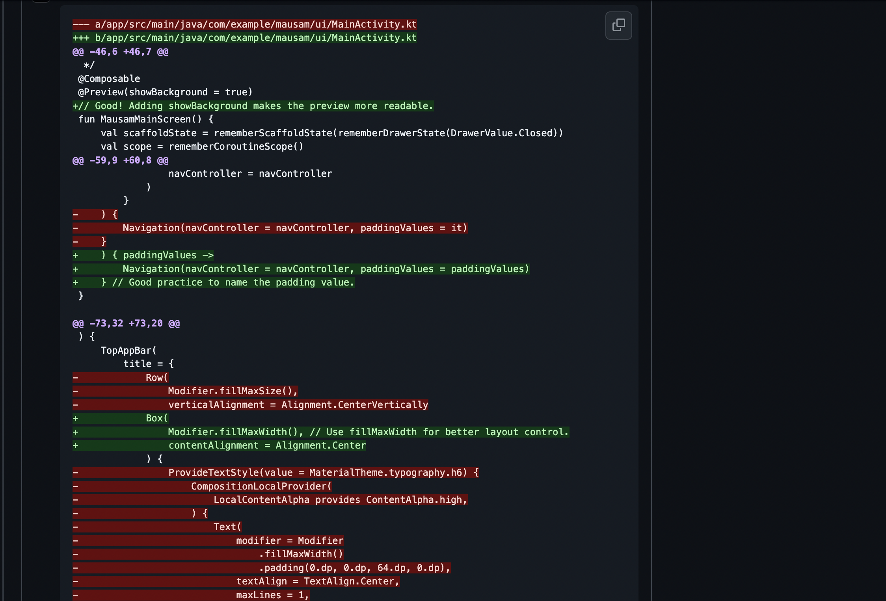

# AI Code Review Bot

This repository contains a GitHub Actions script for automated AI-powered code review using Gemini and GitHub API.

## Features
- Fetches changed files in a pull request
- Uses Gemini to generate actionable inline review comments
- Posts comments directly to the pull request

## Example: AI Review Inline Comment

Below is a screenshot showing how the AI Code Review workflow leaves inline comments on a pull request:

## Getting Started

### Prerequisites
- Python 3.7+
- Set the following environment variables in your GitHub Actions workflow:
  - `GITHUB_TOKEN`: GitHub token with repo access
  - `GITHUB_REPOSITORY`: e.g. `owner/repo`
  - `GITHUB_REF`: GitHub ref for the PR (e.g. `refs/pull/123/head`)
  - `GEMINI_API_KEY`: API key for Gemini

### Usage
1. Place your Python scripts in `.github/scripts/`.
2. Use this script as part of a GitHub Actions workflow to review pull requests automatically.

## File Structure
- `.github/scripts/ai_code_review.py`: Main script for code review automation
- `README.md`: Project documentation

## Customization
- You can modify the review prompt in `generate_review_comment()` to fit your code review guidelines.

## License
MIT
